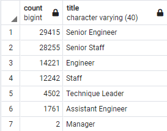

# Pewlett-Hackard-Analysis

## Background
Pewlett-Hackard as fallen behind their data structure and organization. There are multiple records with valuable employee information, however these are stored in several .CSV files, so creating reports and searching for information with correlated information is very painful and time consuming.

We have taken on the challenge on creating a company's database to maintain data integrity and as well to create the entity relationship diagram (ERD) that is a type of flowchart that highlights different tables and their relationships to each other. The ERD does not include any actual data, but it does capture the following pertinent information from each CSV file and will be useful to create queries and reports.

After reviewing the CSVs, Pewlett-Hackard's ERD has been outlined as:

Once the ERD has been defined we are creating a Database called PH-EmployeeDB using PostgreSQL, adding the corresponding tables and importing the data from the CSV files.

## Deliverable 1: The Number of Retiring Employees by Title.

Using the Pewlett-Hackard's ERD we are creating a Retirement Titles table that holds all the titles of current employees who were born between January 1, 1952 and December 31, 1955. 

## Deliverable 2: The Employees Eligible for the Mentorship Program.

Using the Pewlett-Hackard's ERD we are creating a mentorship-eligibility table that holds the current employees who were born between January 1, 1965 and December 31, 1965.

### Results:

- There is a large number of personnel that might be retiring 90,398.
- 64% of the retiring personnel are senior members of the company.
- Only 2 managers are in the lookup for retiring.
- 1,549 employees are deemed for mentorship eligibility.

### Summary:

Pewlett-Hackard might be facing a major problem ahead, while there is a large number of staff that might be retiring, is the most experienced, the senior personal that are on the verge of retiring thus affecting the company expertise at later stages.
It is also concerning that there is not enough personal that has been identified for mentoring, leaving a large gap from those who might leave the company.

We could develop more queries in an attempt to mitigate the problem, for example to know the number of technical personal and administrative personal that distributed among the different departments to identify where the main focus of our priorities should be.

We could also run an additional query to identify manager-replacement candidates from the most experienced personnel that have been working in the company long time and are still in an appropriate age before retiring.

